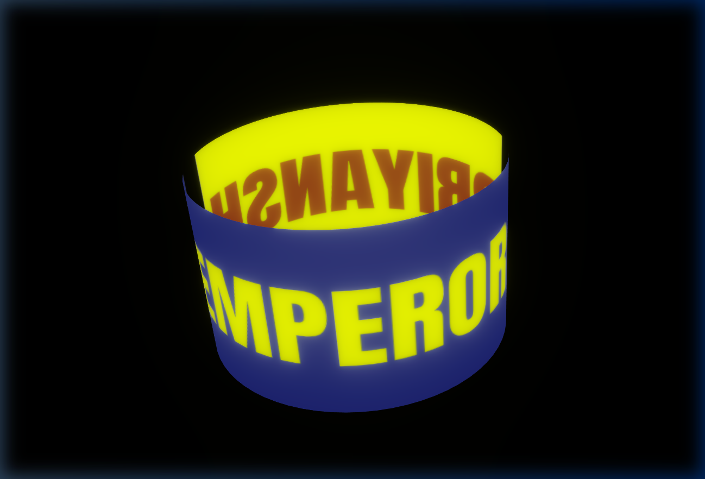

<div align="center">
  <br />
  
  <br />
  <br />
  <h1 align="center">Cylinder Element</h1>
  <p align="center">
    <strong>An elegant, rotating 3D interface element powered by React Three Fiber.</strong>
  </p>
</div>

<br />

##  Overview

The **Cylinder Element** is a premium 3D component designed for modern web applications. It leverages the power of Three.js and React Three Fiber to deliver a mesmerizing, continuously rotating cylinder, complete with custom textures and sophisticated post-processing effects like bloom and dynamic tone mapping.

##  Features

- **Seamless 3D Rendering**: High-fidelity graphics powered by `three.js`.
- **Dynamic Materials**: Custom image mapping with double-sided transparency.
- **Fluid Animation**: Flawless, frame-synced rotation on the Y-axis.
- **Cinematic Post-Processing**: Enhanced visuals featuring soft bloom and adaptive tone exposure.
- **Interactive Canvas**: Full user control via intuitive pan, zoom, and rotate gestures.

<br />

##  Technology Stack

| Technology            | Description                  |
| :-------------------- | :--------------------------- |
| **React (v19)**       | Core UI architecture         |
| **Three.js & R3F**    | 3D engine and React renderer |
| **Vite**              | Blazing fast build tooling   |
| **Tailwind CSS (v4)** | Rapid, utility-first styling |

<br />

##  Getting Started

### Prerequisites

Ensure you have Node.js installed on your system.

### Installation

1. Clone the repository:

   ```bash
   git clone https://github.com/your-username/cylinder-element.git
   cd cylinder-element
   ```

2. Install the necessary dependencies:

   ```bash
   npm install
   ```

3. Start the development environment:
   ```bash
   npm run dev
   ```

<br />

##  Architecture

- `src/App.jsx`: Orchestrates the 3D scene, lighting, camera controls, and render pipeline.
- `src/Cylinder.jsx`: The core interactive element, handling geometry, material mapping, and animation loops.
- `public/screenshot.png`: The texture reference powering the visual identity of the cylinder.

<br />

<div align="center">
  <sub>Crafted with precision using React Three Fiber.</sub>
</div>
